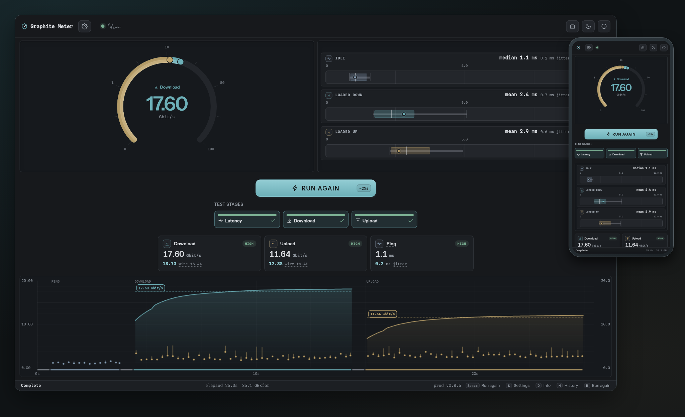

<div align="center">

# Graphite Meter

**A self-hosted, open-source internet speed test that keeps up with modern networks.**

One ~10 MB static binary. Multi-gigabit honest measurements. Beautiful on every screen.

[](https://github.com/zR-JB/graphite-meter/actions/workflows/ci.yml)
[](https://github.com/zR-JB/graphite-meter/releases)
[](https://github.com/zR-JB/graphite-meter/pkgs/container/graphite-meter)
[](LICENSE)



</div>

Built to measure the link, not the tool: in Chrome it sustains **49 Gbit/s down and 17 Gbit/s
up**, and the native terminal client pushes **hundreds of Gbit/s**.\*

## Features

- **Bufferbloat, measured properly** — idle latency is profiled first, then the same ping loop
  keeps running _during_ transfers, so you see how latency degrades under load: average, jitter,
  and range per stage, idle vs. loaded.
- **Honest numbers** — upload throughput is what the **server** received, streamed back live,
  never what the browser thinks it sent. Payloads are incompressible; stalls and reconnects
  can't inflate a result.
- **Clearly separated wire-rate estimates** — default-on Ethernet accounting for IP, TCP/UDP,
  TLS/QUIC, and HTTP framing; a concise estimate appears only beside a completed one-way result.
- **Stages you choose** — latency, download, upload, and a bidirectional stage that saturates
  both directions at once. Adaptive early stopping ends a stage once its result is stable.
- **Configurable from the UI** — connection paths, durations, parallel streams, ping cadence,
  units, gauge scaling. Each role picks its own path from what the server advertises, and every
  card says what it resolves to or why it cannot. No config files.
- **Deploys the way you already deploy** — direct with native HTTP/1.1, HTTP/2, and HTTP/3
  listeners, behind nginx or Caddy, or both at once; clients measure the protocol they actually
  reached, so a proxy in front doesn't falsify results.
- **WebTransport where HTTP/3 runs** — transfers ride QUIC streams, and pings ride unreliable
  datagrams, so reported loss is packets that never arrived rather than a stalled TCP queue.
  Browsers offer it to secure contexts only, so serve the UI over HTTPS (or reach it on
  `localhost`); the terminal client has no such rule. Where it is out of reach the picker says
  which of the two reasons applies, and each role falls back on its own — fetch streams for
  transfers, the WebSocket bus for pings.
- **Optional private access** — operator password, OIDC with a group allowlist, or both,
  covering every asset, transfer, WebSocket, and WebTransport session.
- **Featherweight** — a single static Go binary (~10 MB, browser client embedded,
  `FROM scratch` image, no shell, no libc) with low CPU and memory draw while sinking gigabits.
- **Free and open source** — AGPL-3.0.

## Quick start

Run the published image (multi-arch: amd64 + arm64) and open **http://localhost:7246**:

```sh
docker run -d --name graphite-meter -p 7246:7246 ghcr.io/zr-jb/graphite-meter:latest
```

That is the whole default deployment. The Compose overlays add TLS and authentication on top of
the same image:

| Deployment                     | Command                                                                                                                     |
| ------------------------------ | --------------------------------------------------------------------------------------------------------------------------- |
| Clear HTTP/1.1                 | `docker run -d --name graphite-meter -p 7246:7246 ghcr.io/zr-jb/graphite-meter:latest`                                      |
| Native TLS with H1, H2, and H3 | `GM_PUBLIC_HOST=meter.example.com docker compose -f container/docker-compose.yml -f container/docker-compose.tls.yml up -d` |
| With authentication            | `docker compose -f container/docker-compose.yml -f container/docker-compose.auth.yml up -d`                                 |

Ports 7246–7249 and what each one serves are in
[Native listeners](docs/CONFIGURATION.md#native-listeners). For Podman + systemd, ready-made
Quadlet units — including a rootless Let's Encrypt variant and a Tailscale sidecar — live in
[container/quadlet](container/quadlet/README.md). To serve behind nginx or Caddy, see
[docs/REVERSE_PROXY.md](docs/REVERSE_PROXY.md).

## Native terminal client

The same measurement engine without a browser: `graphite-meter-client` is an interactive TUI
that runs the same stages over the same wire protocol against any Graphite Meter server — and
pushes rates a browser can't.

- Full run setup in the terminal: server URL, stage selection, timings, path and stream choices,
  with live bars, loaded latency, and per-stage progress.
- Throughput and latency paths are chosen independently, each from one list of what the server
  actually advertises — origin and mechanism together (fetch streams over HTTP/1.1, HTTP/2 or
  HTTP/3, WebSocket, WebTransport) — so you pin a path that exists instead of trusting
  negotiation, and the HTTP version stays a choice only where the path leaves one open.
- Works against authenticated servers: it shows a verification code and opens the approval page
  in your browser when you press `enter`, then holds the grant in memory only.

Prebuilt binaries for Linux, macOS, and Windows are attached to every
[release](https://github.com/zR-JB/graphite-meter/releases); the
[flags reference](docs/CONFIGURATION.md#native-tui-client-flags) covers scripted use.

## Docs

Defaults need no configuration. Everything beyond them:

| Document                                       | Covers                                                                              |
| ---------------------------------------------- | ----------------------------------------------------------------------------------- |
| [docs/CONFIGURATION.md](docs/CONFIGURATION.md) | Every runtime option on one page: listeners, TLS, origins, limits, auth, TUI flags. |
| [docs/REVERSE_PROXY.md](docs/REVERSE_PROXY.md) | nginx and Caddy deployments, and the headers measurement and auth require.          |
| [docs/ARCHITECTURE.md](docs/ARCHITECTURE.md)   | How the server, both clients, and the `api/` contract fit together; the roadmap.    |
| [docs/DEVELOPMENT.md](docs/DEVELOPMENT.md)     | Toolchain, `just` recipes, build flags, local TLS certs, building the image.        |
| [docs/BENCHMARKS.md](docs/BENCHMARKS.md)       | Method, per-transport throughput, tuning verdicts, and the limits of the numbers.   |

## Contributing

```sh
git clone https://github.com/zR-JB/graphite-meter.git
cd graphite-meter
just dev     # build the browser client, embed it, run the server on :7246
just ci      # the same checks CI runs
```

Prerequisites and everything else are in [docs/DEVELOPMENT.md](docs/DEVELOPMENT.md).

## License

Graphite Meter — Copyright © 2026 zR-JB

Licensed under AGPL-3.0-or-later. See [LICENSE](LICENSE) and
[COPYRIGHT](COPYRIGHT). Third-party notices are generated for each
distributed artifact.

- Browser: Endpoint Info → About & legal
- Container: `/usr/share/licenses/graphite-meter/`
- Native client: license and notices are included in every release archive

---

<sub>\* Sustained medians of n=5, not peaks. Browser figures are Chromium against a localhost
server over HTTP/1.1 without TLS, at **2 parallel streams** in each direction — the fastest
configuration measured, reproducible from `client/` with
`GM_BENCH_SPKI=<dev leaf SPKI pin> GM_BENCH_ORIGINS=h1-clear GM_BENCH_REPS=5 bunx playwright test
-c playwright.bench.config.ts --project=chromium -g 'h1-clear/(down|up)/lanes=2'` — both halves of
the headline, and the pin is required because without it the `chromium` project does not exist. The
command also needs `../.dev-certs`, which the config loads on every run whatever the origins asked
for; see [Reproduction](docs/BENCHMARKS.md#reproduction). A repeat of the same matrix read 51.9, so
treat the figure as carrying ~6% run-to-run uncertainty. The instantaneous rate reaches ~68 Gbit/s
in individual 200 ms windows, so a live readout shows more than the sustained figure; the sustained
one is quoted. One stream is burstier, not faster: over five repeats it medians 42.37 against two
streams' 49.00, with a range of 36.34–51.33 against an interquartile range of 48.77–49.65, which is
why two is quoted. The native TUI client reaches 363 Gbit/s down at 8 streams and is a separate
measurement, not the browser's. All of it is a hardware-unconstrained loopback best case showing
the tool won't be your bottleneck: over a shaped gigabit link a single stream saturates the line,
and across a real network expect results limited by your NIC, path, and browser. Method,
per-transport numbers, shaped-network results and their limits:
[docs/BENCHMARKS.md](docs/BENCHMARKS.md).</sub>
