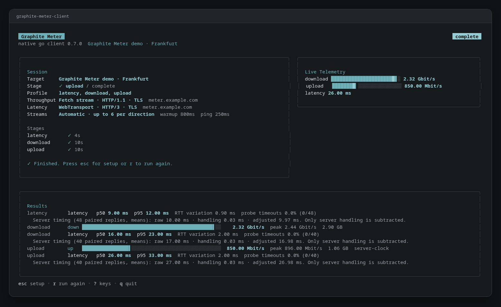

<div align="center">

# Graphite Meter

**Self-hosted network testing for browsers and terminals.**

Measure download, upload, and latency before and during transfers.\
One Go server, a responsive web interface, and a native terminal client.

[](https://github.com/zR-JB/graphite-meter/actions/workflows/ci.yml) [](https://github.com/zR-JB/graphite-meter/releases) [](https://github.com/zR-JB/graphite-meter/pkgs/container/graphite-meter) [](LICENSE)

[Quick start](#quick-start) · [Measurements](#what-you-can-measure) · [Browser](#browser-client) · [Terminal](#native-terminal-client) · [Documentation](#documentation)


<sub>v0.7.0 · simulated measurements · <a href="docs/SCREENSHOTS.md">screenshot gallery</a></sub>

</div>

## Quick start

```sh
docker run -d --name graphite-meter --restart unless-stopped \
  -p 7246:7246 ghcr.io/zr-jb/graphite-meter:latest
```

Open **[localhost:7246](http://localhost:7246)**, or `http://YOUR_SERVER_IP:7246` from another
device, and start a test. The default provides HTTP/1.1 throughput and WebSocket latency,
with no configuration file or database service. Measurements cover the path between your device
and the server, whether that is your LAN, a VPN, or a remote host.

For other setups, see [Docker Compose](docs/DEPLOYMENT.md#docker-compose),
[native TLS and HTTP/3](docs/DEPLOYMENT.md#native-listeners),
[reverse proxies](docs/DEPLOYMENT.md#reverse-proxies),
[Podman](container/quadlet/README.md), or [Tailscale](container/quadlet/tailscale-sidecar/README.md).
Optional [password, OIDC, or hybrid authentication](docs/DEPLOYMENT.md#authentication) protects
both the interface and measurement routes on public deployments.

## What you can measure

**Throughput measured at the receiver.** Downloads count bytes consumed by the client. Upload
bytes and timing come from the server, so data waiting in a sender queue does not inflate the
result. Choose separate download and upload stages, or add simultaneous transfers.

**Latency under load.** Compare idle latency with latency during download, upload, and simultaneous
transfers. Each stage has its own distribution, percentiles, RTT variation, and probe timeout
counts. Paired server timing shows how much of a reply's RTT was spent in the instrumented server
handler. Missing or interrupted evidence stays explicit.

**Control over the connection path.** Select throughput and latency paths independently. Dedicated
listeners expose HTTP/1.1, HTTP/2, and HTTP/3; WebSocket and WebTransport provide latency paths.
Endpoint details distinguish browser-observed and server-observed protocol evidence, including
when a reverse proxy sits between them.

WebTransport needs a compatible browser, HTTPS, a trusted certificate, and reachable HTTP/3 over
UDP. Probe timeouts are application observations, not TCP/IP packet loss. The optional wire-rate
estimate is separate from measured payload throughput. See [measurement definitions](docs/MEASUREMENTS.md)
for exact timing, statistics, and interpretation, or [benchmarks](docs/BENCHMARKS.md) for historical
performance evidence.

## Browser client

Run a test from a phone or desktop without installing a client. The gauge, timeline, and latency
profiles keep transfer speed and responsiveness visible together.

- **Flexible tests:** stage toggles, duration presets or custom timings, automatic or fixed stream
  counts, and optional early completion when a stage stabilizes.
- **Display choices:** light and dark themes, decimal or binary bits/bytes, gauge scaling, and
  keyboard or touch chart inspection with reduced-motion support.
- **Local history:** optionally save up to 2,000 completed summaries on your device. Sort and
  inspect past runs while keeping the live meter available.

See the [gallery](docs/SCREENSHOTS.md) for settings, endpoint details, history, and mobile views.

## Native terminal client

**The same server, directly from your terminal.** `graphite-meter-client` is an interactive Go TUI
with server selection, stage and timing controls, independent connection paths, stream settings,
and live throughput and latency results. It lets you test without browser runtime constraints.



<p align="center"><sub>v0.7.0 · simulated measurements</sub></p>

Download and extract the matching client archive from [Releases](https://github.com/zR-JB/graphite-meter/releases),
then run:

```sh
./graphite-meter-client --url http://YOUR_SERVER_IP:7246
```

Prebuilt clients are available for **Linux and macOS on amd64/arm64**, and **Windows on amd64**
(`graphite-meter-client.exe`). On authenticated servers, approve the terminal's short code in your
browser. The client keeps its measurement grant in memory and does not request your operator password.

[All terminal flags](docs/DEPLOYMENT.md#native-terminal-client) ·
[Build the client from source](docs/DEVELOPMENT.md#development-commands) ·
[Upgrading from 0.6](docs/DEPLOYMENT.md#upgrading-to-07)

## Documentation

- [Deployment and configuration](docs/DEPLOYMENT.md): TLS, authentication, containers, proxies, and troubleshooting.
- [Measurement definitions](docs/MEASUREMENTS.md): what each result measures and how it is calculated.
- [Development](docs/DEVELOPMENT.md): architecture, toolchain, testing, and releases.
- [Benchmarks](docs/BENCHMARKS.md): historical results and reproduction commands.
- Client contracts: [discovery](api/discovery.md), [uploads](api/upload.md), and [latency / WebTransport](api/wire.md).

The browser currently selects among the paths advertised by one deployment. Choosing independent
servers and testing several in parallel are planned.

## Contributing

With [mise installed](docs/DEVELOPMENT.md#prerequisites):

```sh
git clone https://github.com/zR-JB/graphite-meter.git
cd graphite-meter
mise run setup
mise run dev
```

Run `mise run check` before submitting a change. The [development guide](docs/DEVELOPMENT.md)
explains the focused checks and full CI gate.

## License

Copyright © 2026 zR-JB. Licensed under **AGPL-3.0-or-later**; see [LICENSE](LICENSE) and
[COPYRIGHT](COPYRIGHT). Third-party notices ship in the browser's About/legal view, native-client
archives, and `/usr/share/licenses/graphite-meter/` in the container.
