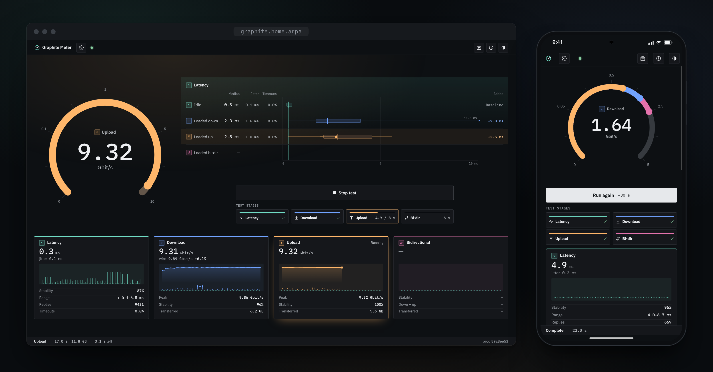
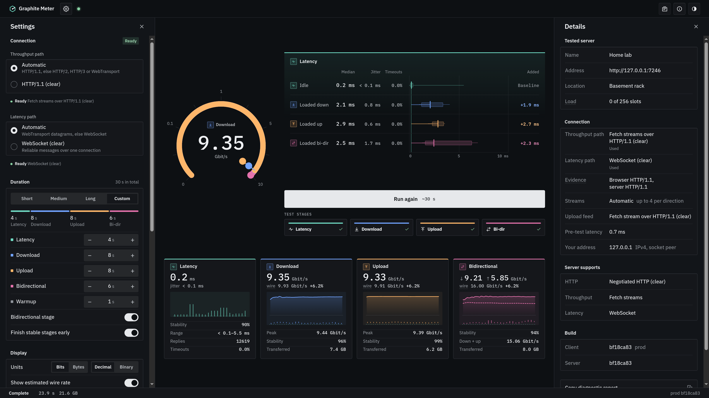
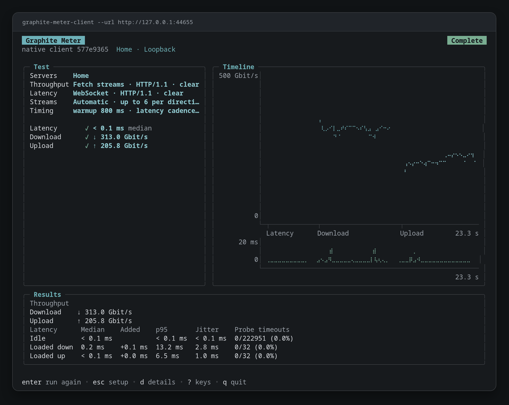

<div align="center">

# Graphite Meter

**Self-hosted network testing for browsers and terminals.**

Measure download, upload, and latency before and during transfers.\
One Go server, a responsive web interface, and a native terminal client.

[](https://github.com/zR-JB/graphite-meter/actions/workflows/ci.yml) [](https://github.com/zR-JB/graphite-meter/releases) [](https://github.com/zR-JB/graphite-meter/pkgs/container/graphite-meter) [](LICENSE)

[Quick start](#quick-start) · [Measurements](#what-you-can-measure) · [Browser](#browser-client) · [Terminal](#native-terminal-client) · [Documentation](#documentation)



<sub>Real runs against local servers · <a href="docs/SCREENSHOTS.md">screenshot gallery</a></sub>

</div>

## Quick start

```sh
docker run -d --name graphite-meter --restart unless-stopped \
  -p 7246:7246 ghcr.io/zr-jb/graphite-meter:latest
```

Open **[localhost:7246](http://localhost:7246)**, or `http://YOUR_SERVER_IP:7246` from another
device, and start a test. The default provides HTTP/1.1 throughput and WebSocket latency,
with no configuration file or database service. Measurements cover the path between your device
and the server, whether that is your LAN, a VPN, or a remote host.

For other setups, see [Docker Compose](docs/DEPLOYMENT.md#docker-compose),
[native TLS and HTTP/3](docs/DEPLOYMENT.md#native-listeners),
[reverse proxies](docs/DEPLOYMENT.md#reverse-proxies),
[Podman](container/quadlet/README.md), or [Tailscale](container/quadlet/tailscale-sidecar/README.md).
Optional [password, OIDC, or hybrid authentication](docs/DEPLOYMENT.md#authentication) protects
both the interface and measurement routes on public deployments.

## What you can measure

- **Throughput measured at the receiver:** downloads count bytes the client consumed; upload bytes and timing come
  from the server, so a sender queue cannot inflate the result. Download, upload and bidirectional stages.
- **One to four servers** from the operator's catalogue on one stage schedule, shown together or one at a time.
  Latency is measured on every selected server. A server that drops out leaves an explicit Partial result with
  its reason.
- **Latency under load:** idle and loaded latency per stage with median, p95, jitter and probe timeouts; added
  latency is the loaded median minus the idle median. Missing evidence stays explicit.
- **Control over the connection path:** throughput and latency paths chosen independently over HTTP/1.1, HTTP/2,
  HTTP/3, WebSocket and WebTransport. **Details** separates browser- and server-observed protocol evidence.

WebTransport needs a compatible browser, HTTPS, a trusted certificate, and reachable HTTP/3 over
UDP. Probe timeouts are application observations, not TCP/IP packet loss. The optional wire-rate
estimate is separate from measured payload throughput. See [measurement definitions](docs/MEASUREMENTS.md)
for exact timing, statistics, and interpretation, or the [benchmark harness](docs/BENCHMARKS.md)
for controlled performance testing.

## Browser client

Run a test from a phone or desktop without installing a client. The dial, the latency card and one card
per stage keep transfer speed and responsiveness visible together: each stage card graphs its rate with the
latency its load added underneath.

- **Flexible tests:** stage switches beside Start, duration presets or custom timings, automatic or fixed
  stream counts, and optional early completion when a stage stabilizes.
- **Server selection:** a **Test servers** checklist in Settings, independent sign-in for protected
  peers, and one server selector over the results (all servers, or one) that the latency card and
  Details follow. Automatic paths resolve per server.
- **Display choices:** light and dark themes, decimal or binary bits/bytes, gauge scaling, and graph
  inspection by pointer, keyboard or touch, with reduced-motion support.
- **Phone layout:** one vertical reading order; the bottom status bar keeps the current stage and remaining
  time visible while you scroll.
- **Wide desktop workspace:** open Settings and Details side by side with the meter. Resize
  each panel to suit your monitor; your widths survive resizing and reload. Below the docked
  layout, one panel opens as a flyout and the URL follows the visible panel.
- **Local history:** optionally save up to 2,000 results on your device, grouped by day. Inspect past runs
  while the live test continues, then return to it from the toolbar. History is not a server-side archive.



<p align="center"><sub>Resizable desktop panels · more in the <a href="docs/SCREENSHOTS.md">gallery</a></sub></p>

## Native terminal client

**The same server, directly from your terminal.** `graphite-meter-client` is an interactive Go TUI
with server selection, stage and timing controls, independent connection paths, stream settings,
and live throughput and latency results. It lets you test without browser runtime constraints.



Download and extract the matching client archive from [Releases](https://github.com/zR-JB/graphite-meter/releases),
then run:

```sh
./graphite-meter-client --url http://YOUR_SERVER_IP:7246
# Select catalogue entries explicitly, including runs without the catalogue host:
./graphite-meter-client --url https://meter.example.net --server frankfurt --server amsterdam
```

Prebuilt clients are available for **Linux and macOS on amd64/arm64**, and **Windows on amd64**
(`graphite-meter-client.exe`). On authenticated servers, approve the terminal's short code in your
browser. The client keeps its measurement grant in memory and never asks for the operator password.
Without a terminal, or with `--report`, it runs once and prints the report; the exit status
reflects the outcome. Such a headless run cannot sign in, so it fails on a protected server.

[Flags, keys and exit codes](docs/DEPLOYMENT.md#native-terminal-client) ·
[Build from source](docs/DEVELOPMENT.md#commands) ·
[Upgrading](docs/DEPLOYMENT.md#upgrading)

## Documentation

- [Deployment and configuration](docs/DEPLOYMENT.md): TLS, authentication, containers, proxies, and troubleshooting.
- [Measurement definitions](docs/MEASUREMENTS.md): what each result measures and how it is calculated.
- [Development](docs/DEVELOPMENT.md): architecture, toolchain, testing, and releases.
- [Benchmark harness](docs/BENCHMARKS.md): controlled throughput testing.
- Client contracts: [discovery](api/discovery.md), [uploads](api/upload.md), and [latency / WebTransport](api/wire.md).
- [Server catalogue and independent authorization](docs/SERVERS.md): configure available servers and interpret simultaneous results.

## Contributing

Set up a checkout as in the [development guide](docs/DEVELOPMENT.md#prerequisites) (`mise run setup`, then
`mise run dev`) and run `mise run check` before submitting a change.

## License

Copyright © 2026 zR-JB. Licensed under **AGPL-3.0-or-later**; see [LICENSE](LICENSE) and
[COPYRIGHT](COPYRIGHT). Third-party notices ship in the browser's About/legal view, native-client
archives, and `/usr/share/licenses/graphite-meter/` in the container.
