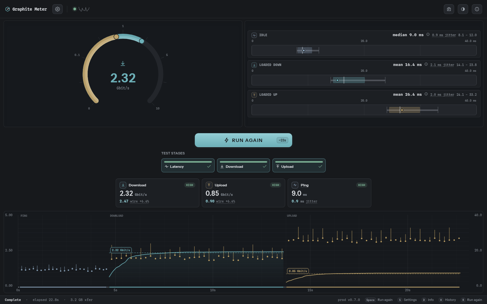
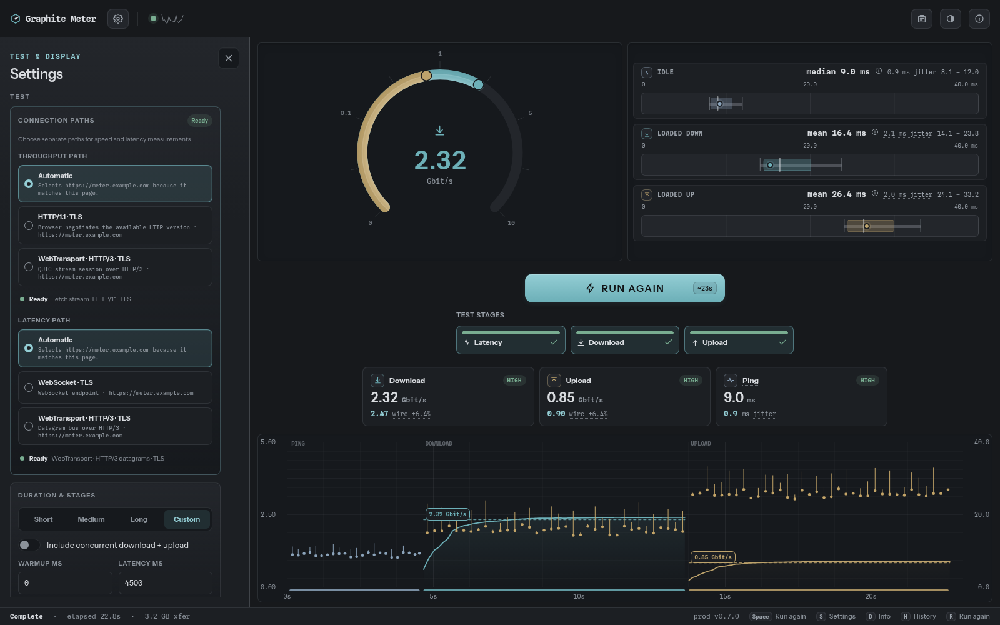
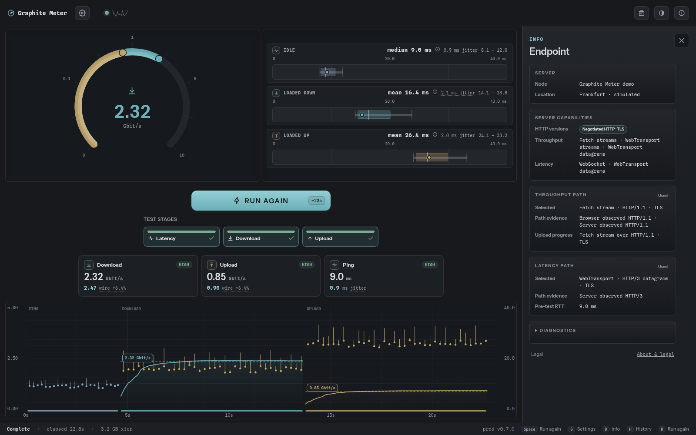
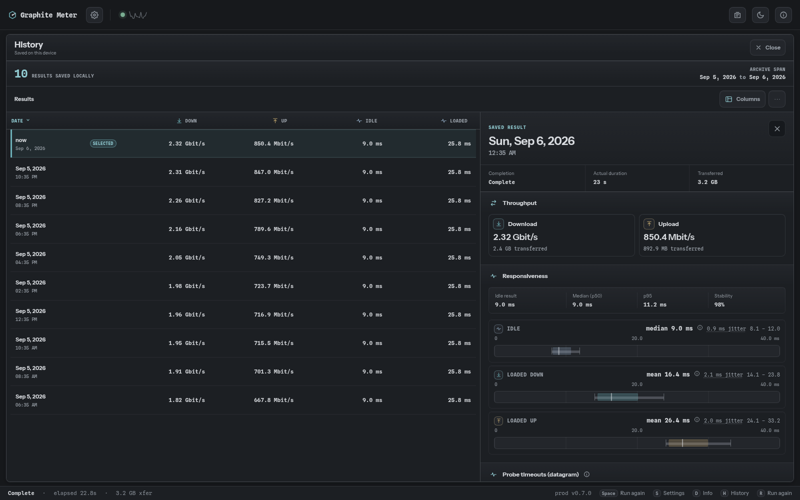
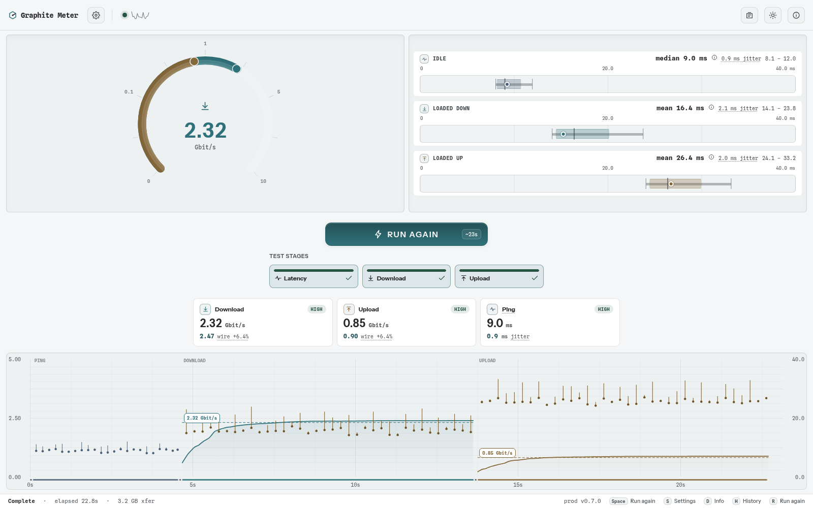
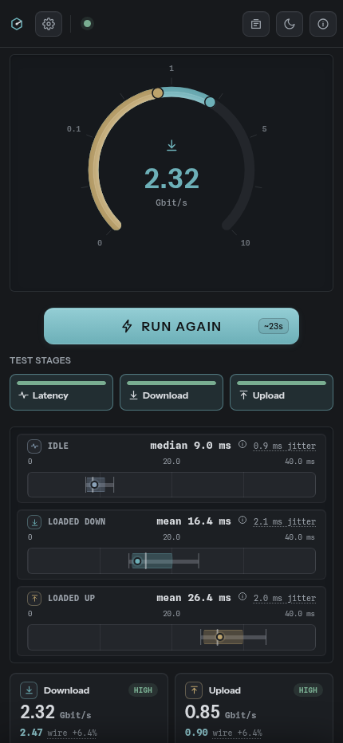

# A look around Graphite Meter

[Project overview](../README.md) · [Quick deployment](DEPLOYMENT.md#fast-local-deployment) · [What the numbers mean](MEASUREMENTS.md)

The **v0.7.0** browser client, from the completed test to saved results. These captures use a
simulated deployment and illustrative data throughout; they are not performance benchmarks.

## The completed test

Throughput and responsiveness share the screen. The timeline retains the transfer ramp-up and
variation, while separate latency profiles show idle, download, and upload populations.

## Settings, beside your results

Choose connection paths, stage timings, units, and display options. The dock keeps the instrument
visible while you adjust the test; on smaller screens, the same settings open as a panel.

## Know which path you measured

Endpoint information identifies the server and selected paths. Protocol evidence distinguishes
what the browser observed from what reached the server—useful when a proxy sits between them.

## History on your device

Opt into saving completed summaries, then browse and sort results without replacing the live
meter. The selected result keeps throughput, latency distributions, and probe evidence together.

History is optional and limited to 2,000 summaries per browser. See [the 0.7 upgrade notes](DEPLOYMENT.md#upgrading-to-07)
for older history formats.

## Light and dark, desktop and phone

The interface adapts to the available width. On a phone, the gauge, run controls, latency profiles,
and results form a vertical reading order; additional content remains available by scrolling.

## Capture details

- Production UI built with `VERSION=0.7.0`, `GM_CLIENT_BUILD_PROFILE=prod`, and the explicitly
  enabled dummy backend. The application footer reads `prod v0.7.0`.
- Source UI revision: `ce6ad79`. Chromium engine: `152.0.7977.82`.
- Simulated server: **Graphite Meter demo**, **Frankfurt · simulated**, using a reserved example
  hostname and documentation IP address.
- Three stages only: idle latency, download, and upload. Synthetic receiver observations include
  a transfer ramp and modest variation; latency has distinct, slightly skewed stage populations.
  The normal runner computes the displayed results. History includes illustrative saved summaries.
- Desktop captures are 1600 × 1000; the phone viewport is 430 × 932. The README hero composes
  these captures with a simulated device frame. The UI itself is not rearranged or retouched.

The ordinary production build excludes the dummy backend. To run your own measurements, follow
[deployment and configuration](DEPLOYMENT.md).
