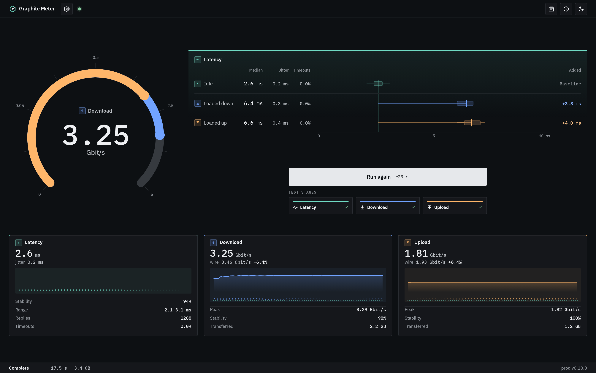
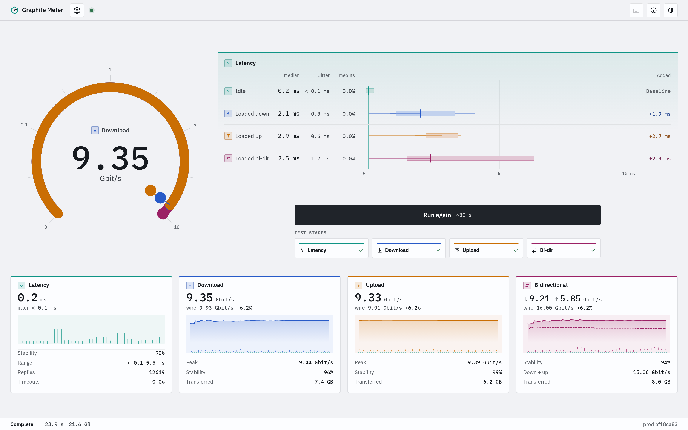
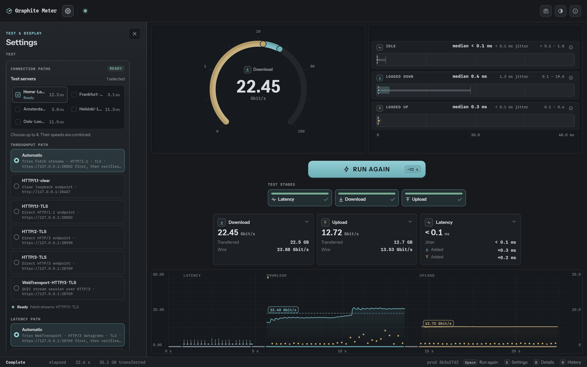
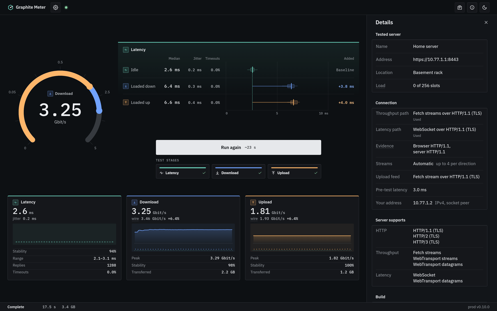
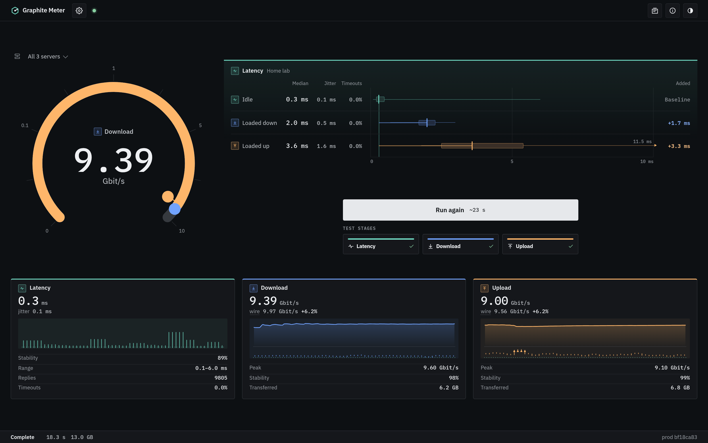
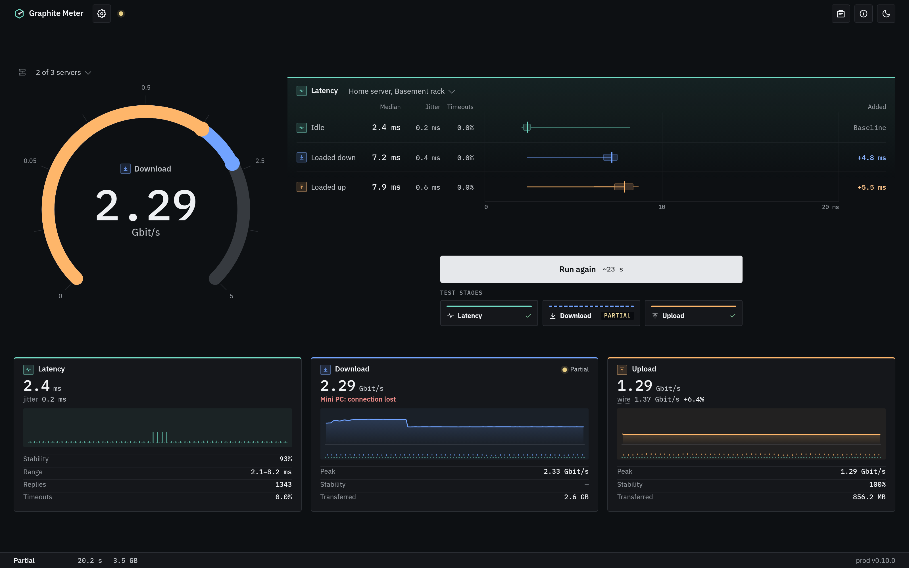
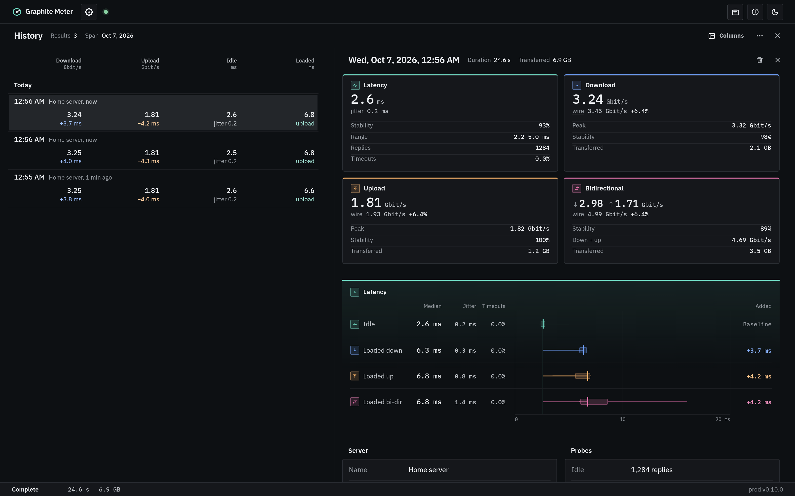
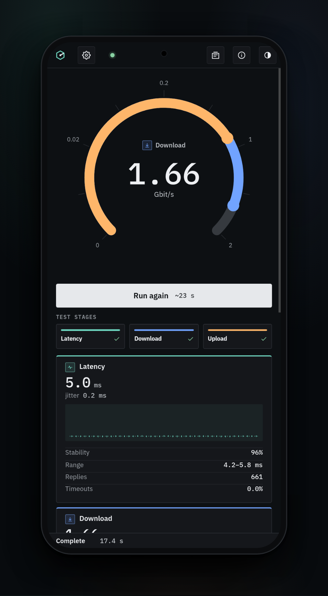
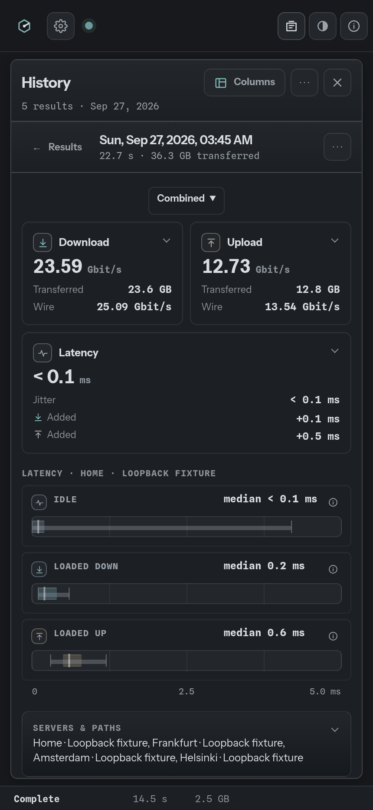

# A look around Graphite Meter

[Project overview](../README.md) · [Quick deployment](DEPLOYMENT.md#fast-local-deployment) · [What the numbers mean](MEASUREMENTS.md)

Every capture is a real run of version 0.10.0. The servers are local, each behind a link shaper that models one
client's path into a 10 GbE home network: a laptop on Wi-Fi 7 for the completed views, a workstation wired at 10 GbE
in the README's hero, and a phone on Wi-Fi 6E. The figures are what the meter measured over those paths, not a
benchmark of a network.

## The completed test

The dial carries the run's headline and every stage's result on one ring; the latency lanes set idle and loaded
latency side by side with what each load added; one card per stage, under its key, keeps the stage's graph with
the latency its load caused underneath.

## Settings and Details

Settings choose servers, connection paths, stage timings and display options. Details name the tested server and
the paths a run used, separating what the browser observed from what reached the server. On a wide desktop both dock
beside the meter.

## Several servers

Up to four servers share one run, their speeds added together, and each is probed for latency. The latency lanes
show one server at a time, named in their head, where another can be chosen at any moment, mid-run included; the
selector over the dial shows the results of all servers or one once the run is done, and Details inspects any
server whenever you like. A server that leaves marks its stage **Partial**, and the card names the reason.

## History on your device

Saved results are grouped by day. Each row shows the rates with the latency their load added, and a result opens with
the live meter's stage and latency cards, its server selector and the evidence sections.

## Phone

A phone keeps the whole run on one screen: the dial, the key, the stages and a compact card per stage with every
fact, the latency lanes under them.

## Native terminal client

The TUI runs the same measurement against the same servers and ends with the results and a timeline.

Browser captures: production build of 0.10.0 over HTTPS, Chrome 154, 1600 × 1000 (workspace 1920 × 1080) at 2×
density, and 430 × 839 at 3× (the screen of a 430 × 932 phone between its status bar and home indicator); stages
latency 4 s, download and upload 8 s, bidirectional 6 s, a 1 s warmup; the dial's maximum automatic.
Paths: the laptop's carries 3.4 Gbit/s down and 1.9 Gbit/s up with 1 ms of one-way delay; the workstation's
9.4 Gbit/s each way with no added delay, of which the capture host's CPU reached about 9; the phone's 1.65 Gbit/s
down and 0.86 Gbit/s up with 1.5 ms. Each queues up to 4 ms of data, so latency under load comes from real
queueing. The three servers of the multi-server run each have their own path (1.3, 1.1 and 1.0 Gbit/s down with 1,
1.5 and 2 ms), together about the laptop's, and the partial run stops the Mini PC's server during download. The
terminal capture is the TUI's own 120 × 40 screen on the workstation's path, replayed in a terminal emulator. Each
capture is shown as a plain screen; the README's hero sets two in a laptop and a phone outline.
To measure your own network, follow [deployment and configuration](DEPLOYMENT.md).
